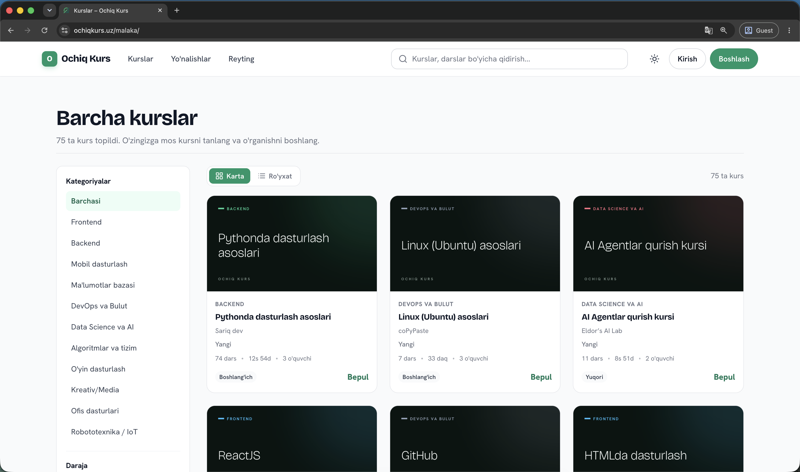
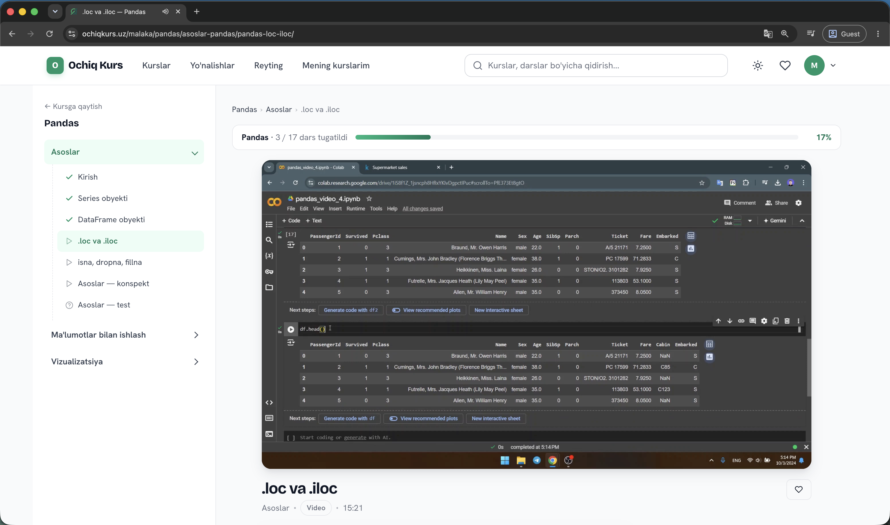
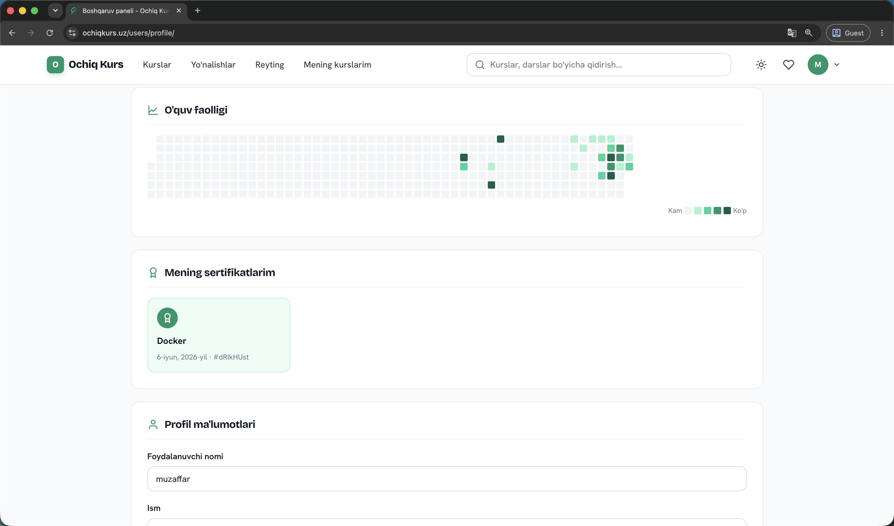
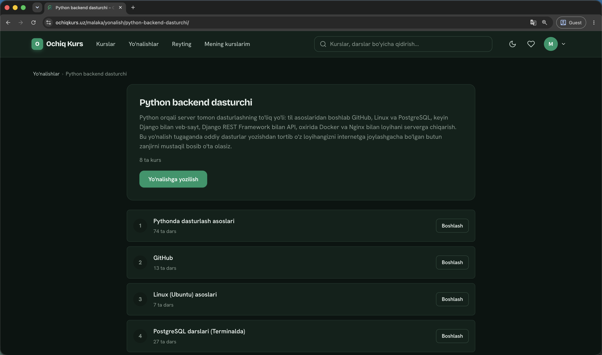
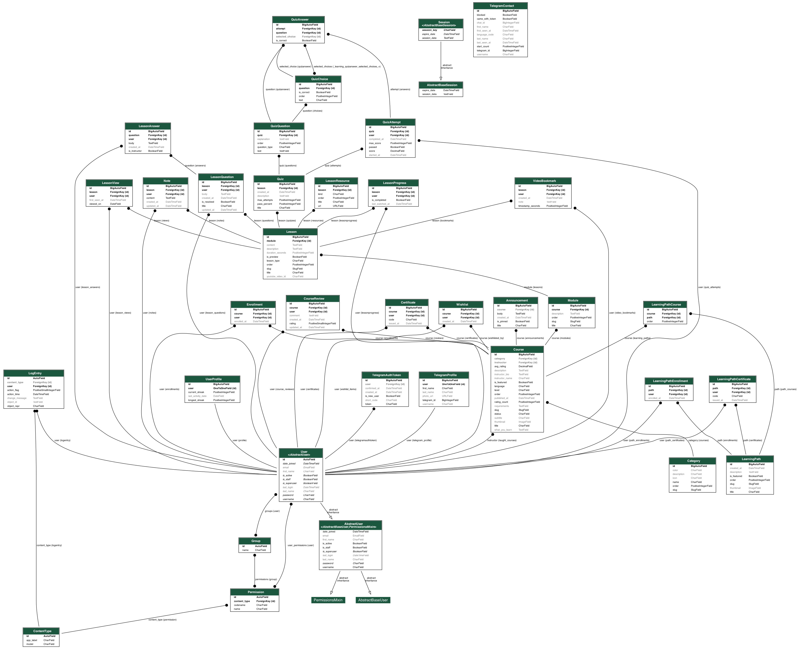

<p align="center">
  <a href="https://ochiqkurs.uz"><strong>Live → ochiqkurs.uz</strong></a>
</p>


# Ochiq Kurs

**Ochiq Kurs** (Ochiq — _open_) is a Django-based Learning Management System for free online video courses in Uzbek. It features YouTube-embedded lessons, article/text lessons, per-lesson quizzes, learning paths (multi-course tracks), progress tracking, Telegram-based authentication, Markdown note-taking, gamified streaks, and a Udemy-style catalog UI.

---

## Screenshots

| Course catalog | Lesson page |
|---|---|
|  |  |

| Learning streak | Dark mode |
|---|---|
|  |  |

--- 

## Features

- **Video & article lessons** — YouTube-embedded videos with timestamp bookmarks, article/text lessons with Markdown rendering
- **Quizzes** — multiple-choice and true/false per lesson, with result tracking
- **Learning paths** — multi-course tracks with path-level certificates
- **Progress tracking** — per-lesson progress, enrollments, view tracking, and auto-completion (≥90% watched)
- **Gamification** — daily streaks with a GitHub-style activity heatmap, public leaderboard
- **Notes** — per-lesson Markdown note-taking with live preview
- **Wishlist** — save courses for later
- **Q&A** — per-lesson questions and answers
- **Announcements** — course-level announcements for enrolled students
- **Certificates** — auto-issued on course/path completion, publicly verifiable by code
- **Instructor profiles** — public profile pages for instructors
- **Telegram auth** — sign in via Telegram bot (with fallback code-based and username/password login)
- **Catalog UI** — filterable course catalog with grid/list views, category cards, and search
- **Dark mode** — opt-in emerald-toned charcoal dark theme, persisted in localStorage
- **SEO** — sitemap, Open Graph, JSON-LD structured data, canonical URLs, robots.txt

---

## Tech Stack

| Layer | Technology |
|---|---|
| Backend | Django 6.0, Python 3.12 |
| Database | PostgreSQL |
| WSGI | Gunicorn |
| Static files | WhiteNoise |
| Frontend | Django Templates + vanilla JavaScript (IIFE modules) |
| Markdown | `markdown` + `bleach` (sanitized) |
| Auth | Django sessions + Telegram bot |
| Images | Pillow (course thumbnails, avatars) |
| Time zone | Asia/Tashkent (UTC+5) |

---

## Getting Started

### Prerequisites

- Python 3.12+
- PostgreSQL
- [Pipenv](https://pipenv.pypa.io/)
- A [Telegram bot](https://core.telegram.org/bots) (for auth)

### Setup

```bash
git clone <repo-url>
cd opencourse
cp .env.example .env          # fill in required values (see below)
pipenv install
pipenv shell
python manage.py migrate
python manage.py createsuperuser
python manage.py runserver
```

### Environment Variables

Copy `.env.example` to `.env` and set:

```bash
SECRET_KEY=                   # Django secret key
DEBUG=False                   # True for local dev
ALLOWED_HOSTS=localhost

DB_NAME=                      # PostgreSQL database name
DB_USER=                      # PostgreSQL user
DB_PASSWORD=                  # PostgreSQL password
DB_HOST=localhost
DB_PORT=5432

YOUTUBE_API_KEY=              # YouTube Data API v3 key (for duration fetching)
BOT_SECRET=                   # Shared secret between Django and the Telegram bot
TELEGRAM_BOT_USERNAME=        # e.g. ochiqkurs_bot

# Production only
SECURE_SSL_REDIRECT=True
SESSION_COOKIE_SECURE=True
CSRF_COOKIE_SECURE=True

# SEO / analytics (optional)
SITE_URL=https://ochiqkurs.uz
GOOGLE_SITE_VERIFICATION=     # Search Console HTML-tag token
GOOGLE_VERIFICATION_FILE=     # Search Console HTML-file filename
CLOUDFLARE_ANALYTICS_TOKEN=   # Cloudflare Web Analytics token (leave empty for automatic setup)
```

---

## Development

### Common Commands

```bash
python manage.py makemigrations        # after model changes
python manage.py migrate               # apply migrations
python manage.py test                  # run the test suite (~39 tests)
python manage.py shell                 # Django REPL
python manage.py fill_durations        # populate lesson durations from YouTube API
python manage.py createcachetable      # provision rate-limiter cache table
python manage.py clear_expired_tokens  # clean up expired Telegram auth tokens
python manage.py collectstatic         # production static files
```

### Code Conventions

- **Python:** snake_case, class-based views for CRUD, `@login_required` for auth routes
- **Templates:** extend `base.html`, use `` tags, custom filters in `learning/templatetags/`
- **JavaScript:** IIFE modules, Fetch API with CSRF tokens, config injected via embedded `<script>` JSON
- **Database:** slugs for routing (never expose PKs), `select_related`/`prefetch_related` for nested queries
- **Tests:** Django `TestCase` in `learning/tests.py` covering progress, quizzes, auth, streaks, certificates

See [`CLAUDE.md`](CLAUDE.md) for detailed conventions and [`docs/architecture.md`](docs/architecture.md) for the full architecture reference.

---

## Authentication Flow

1. User visits `/users/login/` → server creates a `TelegramAuthToken` (10-minute TTL)
2. Frontend shows a Telegram bot link with the embedded token
3. Browser polls `/api/auth/check/<token>/` every 2 seconds
4. Telegram bot POSTs the user's identity to `/api/auth/confirm/` (gated by `X-Bot-Secret`)
5. Server confirms, creates/updates the user, logs them in via Django session
6. Browser receives confirmation → redirects to the catalog

Alternative sign-in methods (code-based and username/password) are also available as fallbacks.

---

## Deployment

CI/CD via GitHub Actions (`.github/workflows/deploy.yml`):

- Triggers on push to `master`
- SSHes into the production server
- Runs: `git fetch` → `git reset --hard origin/master` → `pip install` → `makemigrations --check --dry-run` → `migrate` → `createcachetable` → `clear_expired_tokens` → `collectstatic` → `systemctl restart gunicorn-ochiqkurs` → health check → Cloudflare cache purge

Production serves Gunicorn behind nginx via a Unix socket. The Telegram bot is a separate repo with its own CI/CD pipeline.

---

## Project Structure

```
opencourse/
├── config/                 # Django project settings, root URL conf
├── users/                  # User management (auth, profiles, Telegram integration)
├── learning/               # Course content (models, views, quizzes, bookmarks, paths)
├── templates/              # Django HTML templates
├── static/
│   ├── css/style.css       # Design system (emerald brand + amber accent)
│   └── js/                 # Vanilla JS modules (lesson tracker, notes, bookmarks, UI, search)
├── playlist-fetcher/       # Standalone YouTube playlist fetching utility
├── .github/workflows/      # CI/CD
├── docs/                   # Architecture reference
├── manage.py
├── requirements.txt
├── Pipfile
└── .env.example
```

--- 

### Data model



---

## License

Proprietary. All rights reserved.
